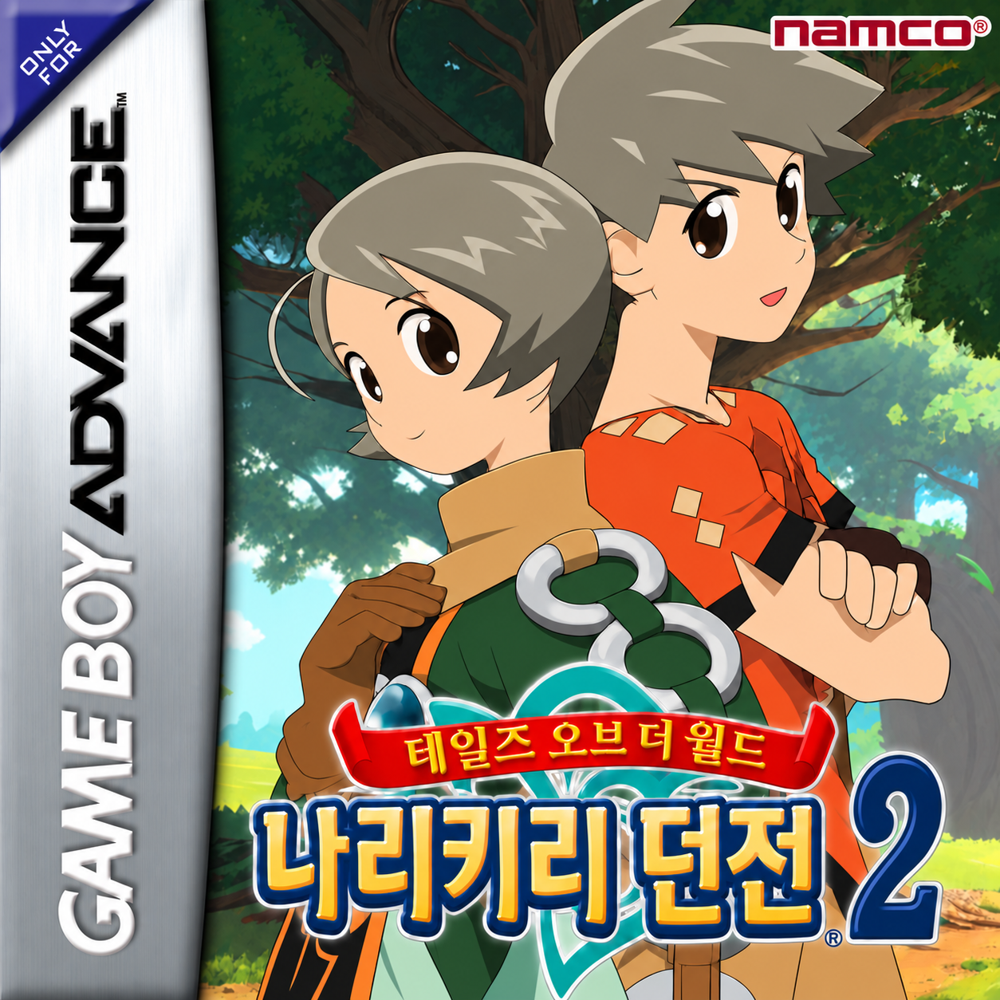

# Xagros의 한글화 패치 — 나리키리 던전 2

**v0.9d 그래픽 수정 테스트판**은 일본어 원본 ROM에 직접 적용합니다. FFR 패치를 별도로 적용할 필요가 없습니다. 기존 한국어 번역에 기여한 **FFR 팀**과 달무리 글꼴 기여자는 [도움주신 분](CREDITS.md)에 기록했습니다.



## 적용

테스트 패키지의 압축을 풀고 Python 3.10 이상으로 실행합니다. 추가 패키지는 필요하지 않습니다.

```powershell
python apply_japanese_patch.py "일본어 원본.gba" --output "Xagros_Narikiri2_KOR_v0.9d_test.gba"
```

| 구분 | 바이트 | SHA-256 |
| --- | ---: | --- |
| AN9J 일본어 원본 | 8,388,608 | `a92c0f6dbb5c013b47b7178e23d81663e3952a10df7b1f68967ebf7bb3b98eb7` |
| v0.9d 테스트 결과 | 13,107,200 | `e9dbed3a744100b02ec1e0a67c153dda850d5c95fcfe32803008397ae6c9a04a` |
| 일본어 원본용 BPS | 4,881,483 | `e483eb112ba2b0480aa6fd0e7eeb69b14165473bf0741c672b9a06145c8f7c68` |

수정하지 않은 일본어 원본에 한 번만 적용합니다. BETA2/BETA3나 이미 패치한 ROM은 입력으로 받지 않으며 기존 파일을 덮어쓰지 않습니다. [자세한 사용법](docs/JP_TEST_PACKAGE.md) · [생성 및 검증 기록](docs/V09D_GRAPHICS_TEST.md)

## 이번 테스트판의 변경

- 시작 화면을 원본의 **Namco / Produced by NAMCO**로 복구했습니다.
- 대열에서 위치를 변경할 때 선택 테두리가 깨지던 압축 형식 바이트를 복구했습니다.
- 저장소 표지를 사용자가 새로 제공한 이미지로 교체했습니다.
- 일본어 원본용 BPS와 적용 도구를 구성했습니다. v0.9c의 번역·글꼴·저장 수정을 유지하며 이번 변경에서 추가 대사 교정은 하지 않았습니다.

로컬 테스트 세이브는 초반 진행 상태에서 **아이템 156종 각 1개**, **몬스터·코스튬·인물 도감 해금**을 제공합니다. 게임 내 저장 후 재실행하여 보존을 확인했으며 도감 142/200/22개 목록과 상세 화면을 확인했습니다. 모든 옷의 소유, 기술 습득이나 스토리 완료를 뜻하지 않습니다. 세이브와 ROM은 저장소와 패치 ZIP에 포함하지 않습니다.

## 저장과 검증 범위

BETA3에서 이어받은 EEPROM 저장 코드는 그대로 유지합니다. **v0.5 저장 복구 패치를 추가 적용할 필요가 없습니다.** [이전 배포 중단 이유](docs/V05_RETIREMENT.md)를 참조하십시오.

기존 8 KiB 게임 저장을 사용할 때는 원본을 백업하고 ROM과 SAV의 파일명을 확장자를 제외하고 같게 맞추십시오. 이전 ROM의 강제저장(savestate)은 재사용하지 마십시오.

mGBA PC에서 확인한 테스트판입니다. [실기·장시간 전체 진행 검증 과제](https://github.com/GimoXagros/gba-narikiri2-kor/issues/4)는 남아 있습니다. 과거 [v0.9c 프리릴리즈](https://github.com/GimoXagros/gba-narikiri2-kor/releases/tag/v0.9c)와 기존 릴리즈 자산은 이력으로 보존합니다.

## 출처와 공개 범위

표시 명칭은 **Xagros의 한글화 패치**입니다. 기존 FFR 번역을 기반으로 한 사실과 후속 수정 내역은 출처 기록에 남깁니다. 신규 코드의 MIT 라이선스는 원 게임·기존 번역·표지 이미지의 권리를 변경하지 않습니다.

[도움주신 분](CREDITS.md) · [권리 고지](RIGHTS.md) · [달무리 출처](THIRD_PARTY_NOTICES.md) · [기존 빌드 방법](BUILDING.md) · [이전 번역 검증](VERIFICATION.md)
